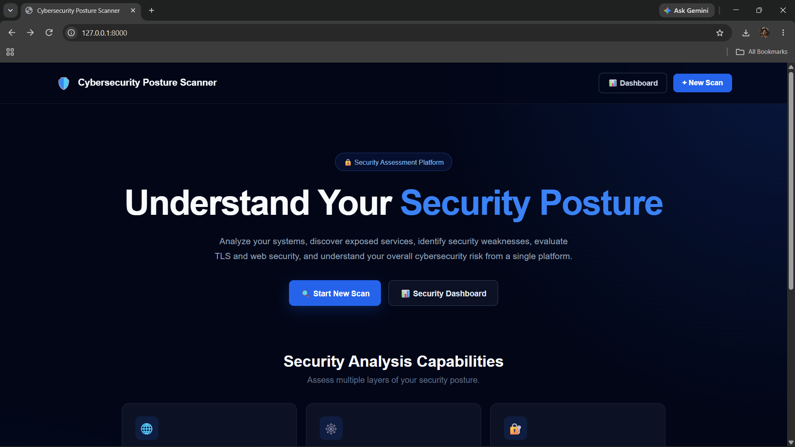
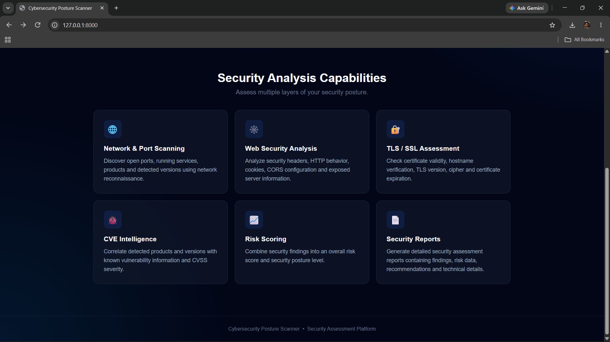

# 🛡️ Cybersecurity Posture Scanner

A Django-based cybersecurity posture assessment platform designed to analyze the security posture of websites and network targets.

The platform combines **network reconnaissance, web security analysis, TLS/SSL assessment, vulnerability intelligence, CVE analysis, and risk scoring** into a single security assessment workflow.

> ⚠️ **Disclaimer:** This project is intended for authorized security testing, educational purposes, and defensive security assessment only. Do not scan systems without proper authorization.

---

## 🚀 Features

### 🔎 Network & Port Scanning

* Nmap-based network reconnaissance
* Open port detection
* Service detection
* Service/version identification
* XML-based Nmap result parsing

### 🌐 Web Security Analysis

* Website security assessment
* HTTP security checks
* Security header analysis
* Web configuration checks
* Detection of common security weaknesses

### 🔐 TLS/SSL Analysis

* TLS/SSL configuration assessment
* Certificate validation
* Certificate expiry checking
* HTTPS security analysis

### 🧩 Vulnerability & CVE Intelligence

* Service/version based vulnerability analysis
* NVD/CVE intelligence integration
* CVE identification
* CVSS-based severity assessment
* Vulnerability risk information

### 📊 Risk Assessment

* Finding-based risk calculation
* Severity classification
* Overall security score
* Risk-level classification
* Combined network, web and TLS risk analysis

### 📄 Security Reports

* Detailed scan results
* Security findings
* Risk information
* Recommendations
* PDF security report generation

### 📈 Scan Management

* User authentication
* Scan history
* Individual scan details
* Security posture comparison
* Security recommendations

---

## 🏗️ System Architecture

```text
                    ┌──────────────────────┐
                    │      Django Web UI   │
                    └──────────┬───────────┘
                               │
                               ▼
                    ┌──────────────────────┐
                    │     Scan Controller  │
                    └──────────┬───────────┘
                               │
              ┌────────────────┼────────────────┐
              │                │                │
              ▼                ▼                ▼
       ┌────────────┐   ┌────────────┐   ┌────────────┐
       │    Nmap    │   │ Web Scanner│   │ TLS Scanner│
       │   Scanner  │   │            │   │            │
       └─────┬──────┘   └─────┬──────┘   └─────┬──────┘
             │                │                │
             └────────────────┼────────────────┘
                              ▼
                    ┌──────────────────────┐
                    │    Risk Engine       │
                    └──────────┬───────────┘
                               │
                    ┌──────────▼───────────┐
                    │ CVE / Security Intel │
                    └──────────┬───────────┘
                               │
                    ┌──────────▼───────────┐
                    │ Security Posture     │
                    │ Score & Findings     │
                    └──────────┬───────────┘
                               │
                    ┌──────────▼───────────┐
                    │    PDF Reporting     │
                    └──────────────────────┘
```

---

## 🧰 Technology Stack

| Technology       | Purpose                            |
| ---------------- | ---------------------------------- |
| **Python**       | Core programming language          |
| **Django**       | Web application framework          |
| **Nmap**         | Network and service reconnaissance |
| **SQLite**       | Database                           |
| **HTML / CSS**   | Frontend interface                 |
| **ReportLab**    | PDF report generation              |
| **NVD API**      | CVE vulnerability intelligence     |
| **Git / GitHub** | Version control                    |

---

## 📂 Project Structure

```text
cyber-posture-scanner/
│
├── cyber_posture/
│   ├── settings.py
│   ├── urls.py
│   └── ...
│
├── scanner/
│   ├── models.py
│   ├── views.py
│   ├── forms.py
│   ├── validators.py
│   │
│   ├── services/
│   │   ├── nmap_scanner.py
│   │   ├── web_scanner.py
│   │   ├── tls_scanner.py
│   │   ├── risk_engine.py
│   │   ├── cve_intelligence.py
│   │   ├── security_intelligence.py
│   │   ├── posture_manager.py
│   │   └── report_generator.py
│   │
│   └── templates/
│
├── manage.py
├── .gitignore
└── requirements.txt
```

---

## ⚙️ How It Works

The scanner follows a multi-stage security assessment process:

### 1. Target Validation

The submitted target is validated to determine whether it is a valid IP address, hostname, or URL.

### 2. Network Reconnaissance

Nmap performs network and service discovery to identify accessible ports and running services.

### 3. Web Assessment

For web targets, the application performs security-related HTTP and configuration checks.

### 4. TLS Assessment

HTTPS/TLS configuration and certificate information are analyzed.

### 5. Vulnerability Intelligence

Detected services and versions can be correlated with vulnerability intelligence from the NVD/CVE ecosystem.

### 6. Risk Calculation

Security findings are assigned risk points based on their severity and available vulnerability information.

### 7. Security Posture Score

The collected findings are combined to produce an overall security posture score and risk classification.

### 8. Reporting

The assessment results can be stored and generated into a detailed PDF security report.

---

## 🖥️ Installation

### Prerequisites

Make sure the following are installed:

* Python 3.x
* Django
* Nmap
* Git

### Clone the Repository

```bash
git clone https://github.com/sahil-cyber-lab/cyber-posture-scanner.git
```

```bash
cd cyber-posture-scanner
```

### Create Virtual Environment

Windows:

```powershell
python -m venv venv
```

Activate it:

```powershell
venv\Scripts\Activate.ps1
```

### Install Dependencies

```bash
pip install -r requirements.txt
```

### Apply Database Migrations

```bash
python manage.py migrate
```

### Start the Development Server

```bash
python manage.py runserver
```

Open:

```text
http://127.0.0.1:8000/
```

---

## 🔍 Example Security Assessment

The platform can analyze authorized targets and produce information such as:

```text
Target: 127.0.0.1

Open Ports:
- 135  → MSRPC
- 445  → Microsoft-DS

Service Detection:
- Service name
- Product
- Version

Security Analysis:
- Network findings
- Web findings
- TLS findings
- Vulnerability intelligence

Risk Assessment:
- Finding severity
- Risk points
- Overall security score
- Risk level
```

---

## 📊 Risk Assessment

The platform combines multiple security assessment sources:

```text
Network Findings
       │
       ▼
Web Findings ──────► Risk Engine
       │                 │
TLS Findings ───────────┤
                         │
CVE Intelligence ────────┘
                         │
                         ▼
                Security Posture Score
                         │
                         ▼
                  Risk Classification
```

The goal is to provide a consolidated view of the security posture rather than relying on a single scanning technique.

---

## 📸 Screenshots
### Home Page






### Scan Page


### Scan Results


## 🎯 Project Goals

This project was developed to explore how multiple cybersecurity assessment techniques can be integrated into a single platform.

The main goals are:

* Learn practical vulnerability assessment
* Understand network reconnaissance
* Automate security checks using Python
* Integrate security intelligence
* Build a risk assessment workflow
* Generate professional security reports
* Apply cybersecurity concepts to a real-world style project

---

## 🔮 Future Improvements

Possible future improvements include:

* Expanded vulnerability detection
* Additional security scanners
* More CVE intelligence sources
* Improved risk correlation
* Scheduled security assessments
* Email/report notifications
* Advanced dashboard analytics
* Role-based access control
* Containerized deployment
* Cloud deployment

---

## 👨‍💻 Author

### Sahil

**B.Tech Cybersecurity Student | Aspiring Penetration Tester**

Focused on:

`Penetration Testing` · `Web Security` · `Network Security` · `Vulnerability Assessment` · `Kali Linux` · `Python`

GitHub: [@sahil-cyber-lab](https://github.com/sahil-cyber-lab)

---

## ⚠️ Responsible Use

This project is created for **educational, defensive, and authorized security testing purposes**.

Only perform security assessments against systems, networks, and applications for which you have explicit permission to test.
